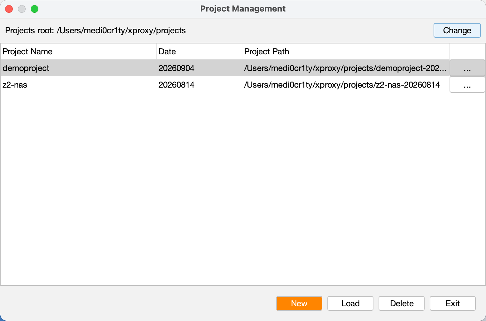
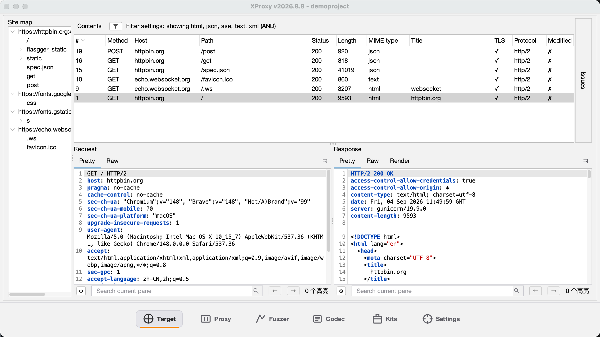
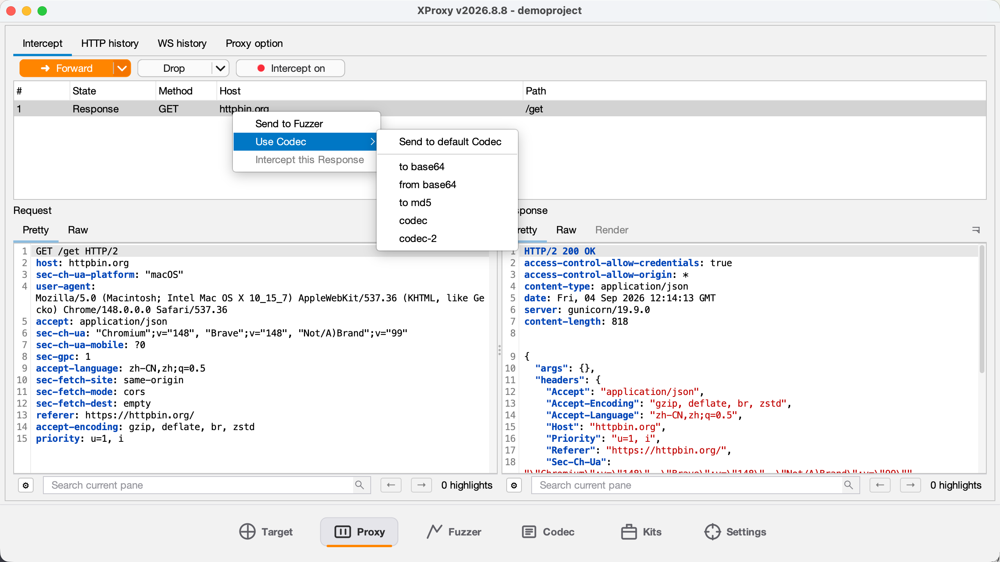
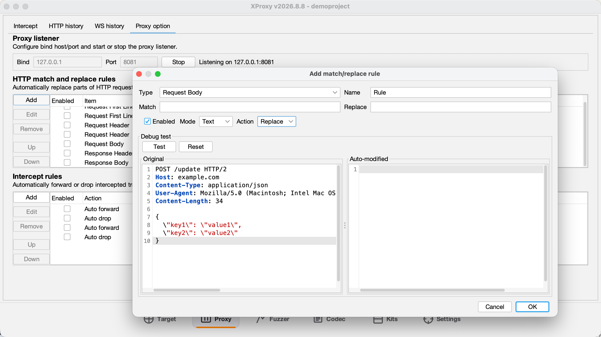
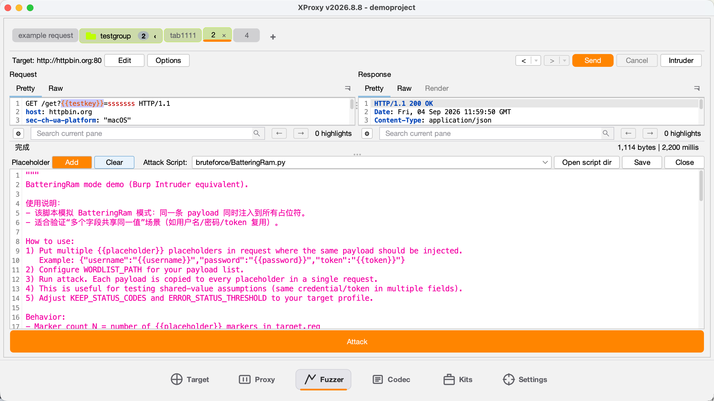
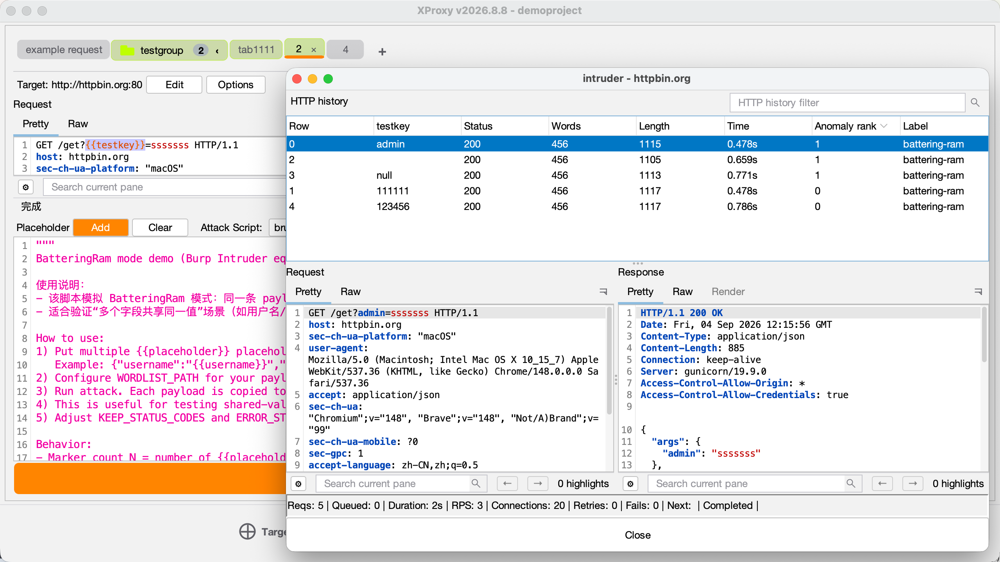
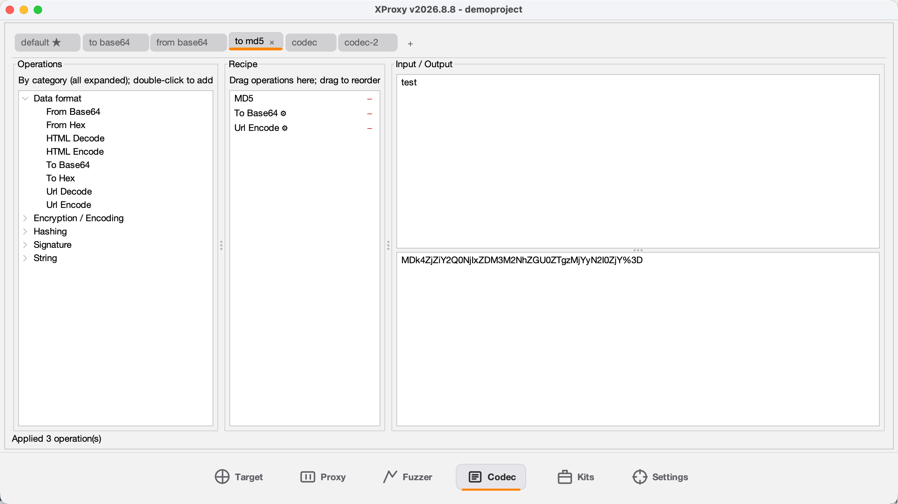
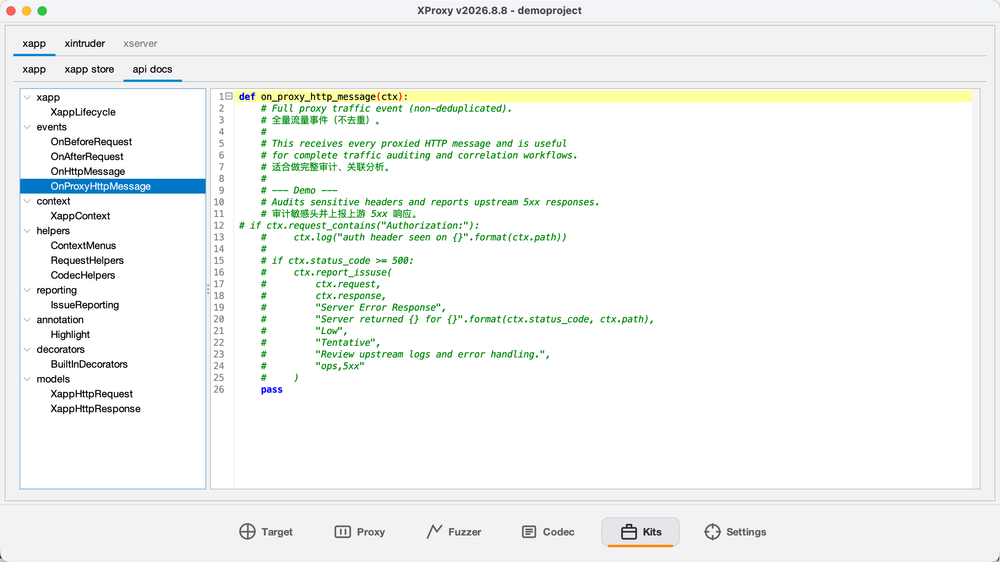
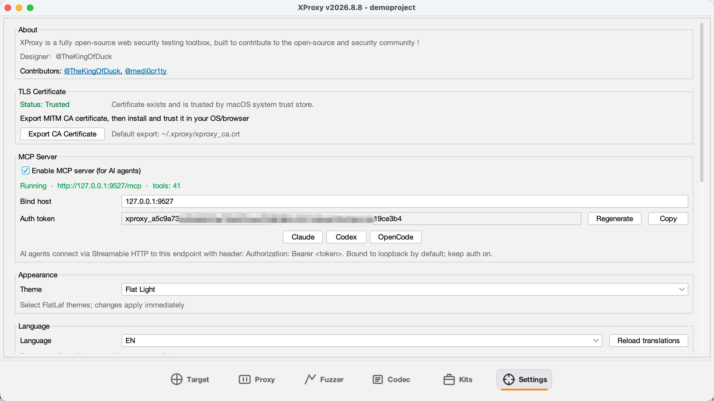

# XProxy

[中文文档](README_zh.md) | English

XProxy is a desktop tool for security testing and traffic analysis, integrating HTTP/WS proxying, history browsing, target archiving, fuzzer request sending, and batch attack capabilities.

## Features

- **Proxy**: Intercepts and forwards HTTP/WS traffic, with rule-based interception, Match/Replace, and upstream proxies.
- **HTTP History**: Browse historical requests/responses, filter by MIME type and keywords.
- **Target**: Aggregates and deduplicates historical traffic into a site tree for quick endpoint discovery.
- **Fuzzer**: Single-shot sending, replay, automatic redirect following, and batch attacks.
- **Codec**: Data encoding/decoding toolkit with 20+ built-in operations:
  - **Data format**: Base64 (standard & URL-safe), URL encode/decode, Hex encode/decode, HTML encode/decode
  - **Hashing**: MD5, SHA1, SHA256, SHA512, HMAC
  - **Encryption**: AES encrypt/decrypt (ECB/CBC modes)
  - **String**: ROT13, reverse, uppercase, lowercase, strip
  - **Signature**: JWT payload decode
- **Kits**: Extensible plugin and scripting ecosystem:
  - **Xapp Plugins**: Python-based plugins with lifecycle management (on_proxy_http_message, on_before_request, on_after_request), passive scanning, request/response rewriting, and context menu integration.
  - **Xapp Store**: Browse and install community plugins from the xapp-store repository.
  - **Intruder Scripts**: Manage and execute Python attack scripts with category support, built-in templates, and persistent state.
- **Settings**: Themes, encoding policies, TLS certificate export and trust status, response rendering thresholds.

## Screenshots



















## Requirements

- JDK 17+
- macOS (required for building the DMG)

## Quick Start

### 1) Build

```bash
./gradlew build
```

### 2) Run the Fat JAR

```bash
./gradlew fatJar
java -jar build/libs/xproxy.jar
```

## Packaging a DMG (macOS)

The project ships with `build.sh`:

```bash
./build.sh
sudo xattr -cr /Applications/XProxy.app
```

The script will:

1. Build the `fatJar`
2. Generate an app-image using `jpackage`
3. Continue to produce a `.dmg`

Output directory: `build/package/dmg`

## Data & Configuration Locations

- Global database: `~/.xproxy/xproxy.db`
- Default project directory: `~/xproxy/projects`

## Tech Stack

- Kotlin / Java (JVM 17)
- Swing + RSyntaxTextArea
- Netty + Proxyee
- SQLite

## Contributors

- [TheKingOfDuck](https://github.com/TheKingOfDuck)
- [medi0cr1ty](https://github.com/Phelaine)
